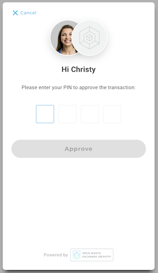
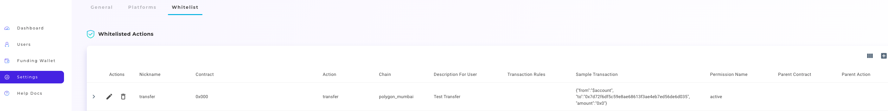

## Signing Transactions with ORE ID

```text
📢 What this article covers: Enable transaction signing in your app.
```

It’s time to add real blockchain functionality to our React application.  This will enable the *```webpopup```* to engage the user in a transaction signing flow.  

The user will be prompted to input their password/pin.  Then, ORE ID service will do the work by preparing and sending your *```transaction```* to the blockchain.  Returned, is the transaction's *```blockchain id```* and ORE ID service process id.  

This article will use *```Ethereum```* (also included are instructions on how to adapt this code to *```Polygon```*). But, later in the series, examples of other supported chains will be demo’d.  Let’s get started by creating a *SignTransaction.js* file.  This will hold the new React component being built in this article.

1. Import the dependencies of our new module.

```jsx
// SignTransaction.js

import { useState } from "react";
import { ChainNetwork } from "oreid-js";
import { useOreId, useUser } from "oreid-react";
```

2. Create the new React component named *SignTransaction*, declare the variables, and define the helper functions.  Return a button which we will hook up shortly.

```jsx
export const SignTransaction = () => {
    const oreId = useOreId();
    const user = useUser();
    const chainNetwork = ChainNetwork.EthRopsten;
    const[ txnId, setTxnId ] = useState("");
    const[ error, setError ] = useState("");

    const onError = ( error ) => {
        console.log("Transaction failed ", error);
        setError( error );
    };

    const onSuccess = ( result ) => {
        console.log( 
            "Transaction Successful. ", JSON.stringify(result)
        );
        setTxnId(result.transactionId)
    };

	return(
        <div>
            <button>
                Send Sample Transaction
            </button>
            {txnId && <div>Transaction Id: {txnId}</div>}
            {error && <div>Error: {error.message}</div>}
        </div>
    );
}
```
> 💥 Polygon adaption!  To interact with the Polygon blockchain, change the *```chainNetwork```* variable from ```ChainNetwork.EthRopsten``` to ```'polygon_mumbai'```.  Resulting in the line  <br />
 ```const chainNetwork = 'polygon_mumbai'```.  
 Your ORE ID application will have to be set for Polygon Mumbai network.  The application network can currently only be chosen while creating a new app.  If you did not select Polygon when the ORE ID application was created;  You can create a new app [here](https://oreid.io/developer/new-app).

3. Next, create another function named *```handleSign()```.* This will contain the creation of the transaction and presentation of the webpopup. First, we need to know the user’s Ehereum Address to fill out the transaction. The logged in user’s Ethereum blockchain account is grabbed from the ORE ID service.  The function will return an error if a chainNetwork account can’t be found for that user.

```jsx
const handleSign = async () => {
    const signingAccount = user.chainAccounts.find(
        (ca) => ca.chainNetwork === chainNetwork
    );
    
    const errorMsg = `User doesn not have any accounts on ${chainNetwork}`;
    
    if (!signingAccount) {
        console.log( errorMsg );
        onError( errorMsg );
        return;
    };
}
```

4. *```handleSign()```* is appended with the transaction that is being pushed to the blockchain.  A JSON object named *```transactionBody```* will hold the details of a very simple transaction.  The transaction transfers zero value to yourself.  This is done to test the transaction ability.

```jsx
        const transactionBody = {
            from: signingAccount.chainAccount,
            to: signingAccount.chainAccount,
            value: 0
        };
```

5. While still building out the *```handleSign()```* function, it is now time to build the full transaction that will be signed by the user and sent to the blockchain.   The oreId instence calls the *``createTransaction()``* function and passes it the necessary pparameters.  We are returned a transaction object.

```jsx
        const transaction = await oreId.createTransaction({
            chainAccount: signingAccount.chainAccount,
            chainNetwork: signingAccount.chainNetwork,
            transaction: transactionBody,
            signOptions: {
                broadcast: true,
                returnSignedTransaction: false,
            },
        });
```

6. To finish *```handleSign()```*, the oreId instance uses the webpopup plugin by calling *```oreId.webpopup.sign()```*.  This launches the webpopup and begins the transaction signing flow. 

```jsx
        oreId.popup
            .sign({ transaction })
            .then( onSuccess )
            .catch( onError );
```

7. Hook up the handleSign() function to onClick button.

```jsx
            <button
                onClick={() => {
                    handleSign()
                }}
            >
                Send Sample Transaction
            </button>
```


Test the transaction and you will be prompted to enter your password/pin.




Upon successful entry of password/pin, the transaction will be sent to the blockchain.  You will most likely be presented with an error.  This is becuase you currently do not have any funds in your account.  Use a Ropsten testnet faucet to add testnet funds to your chainNetwork account. Revisit step 3 for the code to find your ethereum blockchain account.

## Troubleshooting

Error messages will be output to your browser if something goes wrong with the transaction process.  Some common error message examples and the fixes are below.

### ❌ Error: Whitelisting Permission

```text
Error: sign_transaction_rejected&error_message=Permission active must be one of the whitelisted permissions. Or contract 0x0000000000000000000000000000000000000000 and action transfer must be whitelisted in App Registration.
```
> ✅ Solution:<br/>
  Add a whitelist entry to your application's developer dashboard.  For each blockchain action enabled, a proper whitelisting entry must be made.  Whitelisting is important because it allows only the requested actions to be ran on the the blockchain.  This will stop unwanted or malicious actions from being executed by the ORE ID service.



### ❌ Error: TxExceededResources

```text
Error: sign_transaction_rejected&error_message=ChainErrorType:TxExceededResources - Chain Transaction failure: Error Returned error: insufficient funds for gas * price + value on chain network eth_ropsten for user google-oauth2|101800000000000004300 of app t_c304ed0f2bxxxxx98b8c8e91a9874ec5 . Error from chain: {"originalError":{"data":null},"errorType":"TxExceededResources"}
```

> ✅ Solution: <br />
You do not have enough funds in your chainAccount to perform the requested action.  Add Ropsten testnet funds using a faucet (Ex: https://faucet.egorfine.com/).